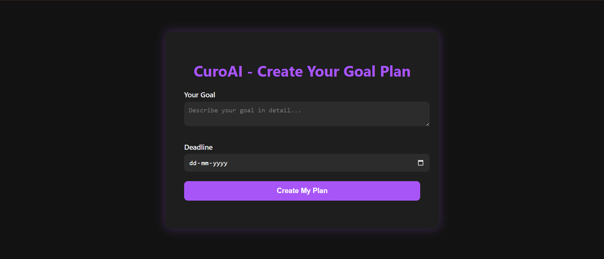

# 🧠 CuroAI - Goal Submission Page

This is a responsive, single-screen web app where users can submit their personal goals and deadlines. The goal is to simulate a real-world planning tool by combining a smooth UI with a mock API integration.

---

## 🌐 Live Demo

👉 [Try it on GitHub Pages](https://ekakshagr.github.io/curoai-goal-page/)

> Replace `yourusername` with your actual GitHub username above.

---

## 🚀 Features

- 📝 **Text input** for entering detailed goals
- 📅 **Date picker** that prevents past date selection
- 🔄 **POST request** to a mock API endpoint
- 🌙 **Dark UI** with purple accent color
- ⚡️ Fully client-side (no backend setup required)
- 📱 Mobile responsive (works on all screen sizes)

---

## 🎨 Design Choices

- **Dark Theme**: Improves readability in low-light conditions and gives a modern feel.
- **Purple Accent**: Purple (`#a855f7`) is associated with creativity and ambition—fitting for a goal-setting app.
- **Rounded Cards and Buttons**: Soften the UI and make it more inviting.
- **Minimalist Layout**: Focus is kept solely on input and action with no distractions.
- **Inverted Calendar Picker Icon**: Ensures visibility on dark backgrounds.

---

## 🛠️ Tech Stack

| Layer       | Tool/Technology      | Purpose                                |
|-------------|----------------------|----------------------------------------|
| Frontend    | HTML5, CSS3, JavaScript | Core structure, styling & logic       |
| API (Mock)  | [Beeceptor](https://beeceptor.com/) | Simulate backend POST request     |
| Hosting     | GitHub Pages          | Easy static hosting                    |
| Dev Tools   | VS Code, Git, GitHub  | Local development & version control    |

---

## 📸 Screenshot



---

## 📦 How to Run Locally

```bash
git clone https://github.com/ekakshagr/curoai-goal-page
cd curoai-goal-page
open index.html
